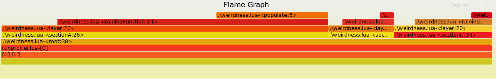
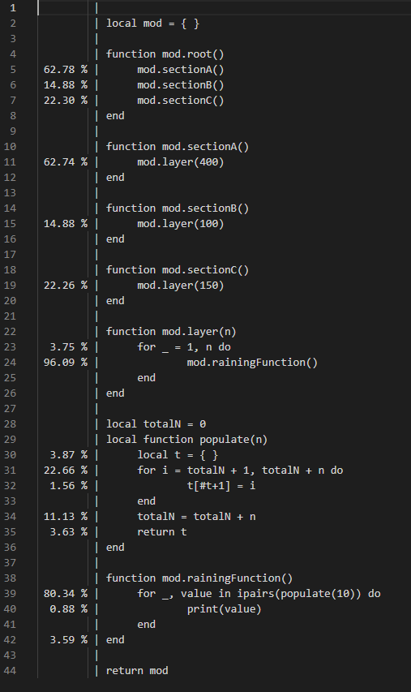
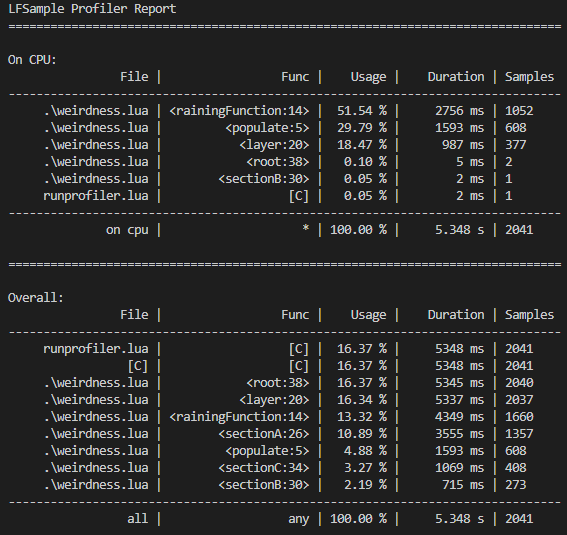

# LFSampler

LFSampler is a sample profiler, for `Lua 5.1-5.4` or `LuaJIT`.
It uses the jit profiler, if available, or the debug library.

# Demos

Check out the example, to regenerate the report yourself!

## Interactive Flamegraphs



How it works:

```lua

local lfsampler = require "lfsampler"
local formatter = require "lfsampler.formatter"

lfsampler.start()
-- Some code
lfsampler.finish()

local file = io.open("output.cap", "w")
file:write(formatter.flamegraph(lfsampler.popResults(), "graph", formatters.granularityFunc))
file:close()

```

Now use [FlameGraph](https://github.com/brendangregg/FlameGraph), to generate the svg:
```
<flamegraph> output.cap output.svg
```
Flamegraphs are awesome, I highly recommend checking out this video.

## Source annotations



How it works:

```lua

local lfsampler = require "lfsampler"
local formatter = require "lfsampler.formatter"

lfsampler.start()
-- Some code
lfsampler.finish()

local sources = formatter.annotateSource(lfsampler.popResults())
for name, data in pairs(sources) do
	local file = io.open(name:gsub("%.lua", ".tlua"):gsub("/", "."):gsub(), "w")
	file:write(data)
	file:close()
end

```

# Getting started

## Installing

Either install via:
```
luarocks install lfsampler
```
or drop the `lfsampler` folder into your `package.path`.

## Running sampler

It is as simple as that:

```lua

local lfsampler = require "lfsampler"
local formatter = require "lfsampler.formatter"

lfsampler.start()
-- Some code
lfsampler.finish()

local file = io.open("output.cap", "w")
file:write(formatter.basicReport(lfsampler.popResults()))
file:close()

```

With:



# Manual

##  Debugger priority at startup
1. JIT
2. debug
3. dummy

In code documentation available via [Lua Language Server](https://github.com/sumneko/lua-language-server/).

# lfsampler


`lfsampler.start():`

Starts the session.

`lfsampler.stop():`

Stops the session

`lfsampler.popResults(): ProfilerResults`

Returns results and then discards them. Use this if you want to have seperate session results.

`lfsampler.getResults(): ProfilerResults`

Returns current accumulated results (copy).
Check out available `formatters` or `ProfilerResults` to build your own.

`lfsampler.discard()`

Discards current results. If they are not discarded, any subsequent sessions, will accumulate.

`lfsampler.setProfiler(profiler_type: "jit" | "debug" | "dummy", n: integer)`

Sets profiler to use.
n: debug: The instruction rate at which samples are collected, jit: Sample rate in milliseconds. Is OS-Dependant
Errors, if profiler is unavailable. Call it with pcall or use `lfsampler.isAvailable(profiler)`

`lfsampler.anyAvailable(): boolean`

Checks whether an profiler is available ("jit" or "debug" ignoring "dummy").

`lfsampler.currentProfiler(): "jit" | "debug" | "dummy"`

Retrieves current selected profiler.

`lfsampler.isAvailable(profiler: string): boolean`

Returns whether or not specified profiler is available

`lfsampler.isRunning(): boolean`

Returns whether or not the profiler is running.

# lfsampler.formatters

`formatters.formatReport(results: ProfilerResults): string`

Formats given results into an easly printable report.

`formatters.flamegraph(results: ProfilerResults, type: "graph" | "chart", granularityFormatter fun(stacktrace: lfsampler.Stacktrace)):`

Formats results according to [FlameGraph](https://github.com/brendangregg/FlameGraph/blob/master/flamegraph.pl)
Format: `<file>(:<line>)?-<func>;... <samples>\n...`
e.g. `formatters.granularityLine`
`formatters.annotateSource(results: ProfilerResults): { [path]: annotated_source_code }`
Returns completly annotated source code foreach module.

`formatters.granularityFunc():`

Hash function for stacktrace by file and function name

`formatters.granularityLine():`

Hash function for stacktrace by file and function name and line

`formatters.sortBySampleCount():`

Comparates two { sampleCount: integer } by >

# ProfilerResults

`ProfilerResults.totalSamples`

Total sample count
Accumulated duration

`ProfilerResults.duration`

Accumulated duration.

`ProfilerResults:accumulate(hash fun(stacktrace: Stacktrace)): ProcessedResults`

Accumulates all stacktraces collapsed by given hash function.

`ProfilerResults:squash():`

Same as accumulate, but keeps order.

# Other Structures

```
ProcessedResults: {
	probes: Probe[],
	totalSamples: integer
}
```

```
Probe: {
	stacktrace: Stacktrace,
	sampleCount: integer
}
```

```
Stacktrace: Location[]
```

```
Location: {
	file: string,
	func: string,
	line: integer,
}
```

## Missing documentation

Any missing documentation means, it was not intended to be used outside of the profiler.